# Asistente de Importación Genérico - Documentación Técnica Completa

## 🚀 Sistema de Importación Avanzado Basado en Metadatos

### Características Principales del Nuevo Sistema
El sistema de importación genérico (`/api/v1/import`) es una solución empresarial completa que replica la experiencia de Odoo:

- 🎯 **Asistente guiado paso a paso** con feedback visual en tiempo real
- 🧩 **Importación basada en metadatos** - completamente genérico para cualquier modelo
- 🔄 **Mapeo inteligente** con autocompletado y sugerencias automáticas
- ✅ **Validación previa completa** antes de ejecutar importación
- 📊 **Políticas de importación flexibles** (crear, actualizar, upsert)
- 💾 **Plantillas reutilizables** para configuraciones de mapeo
- 📈 **Feedback detallado** con métricas de progreso y errores específicos
- 🔒 **Control de acceso granular** por modelo y operación

### Arquitectura Basada en Metadatos
El sistema utiliza un enfoque orientado a metadatos que permite:
- **Configuración automática** para nuevos modelos sin código adicional
- **Validaciones dinámicas** basadas en esquemas de datos
- **Resolución inteligente** de relaciones many-to-one
- **Tipos de datos tipados** con conversiones automáticas

---

## 1. Sistema de Metadatos de Modelos

### Definición de Metadatos por Entidad
Cada modelo del sistema (Factura, Cliente, Producto, etc.) tiene metadatos que definen:

```python
@dataclass
class FieldMetadata:
    internal_name: str          # Nombre interno del campo ("invoice_date", "customer_id")
    display_label: str          # Etiqueta para mostrar al usuario ("Fecha de Emisión", "Cliente")
    field_type: FieldType       # Tipo de dato (string, date, number, boolean, many_to_one)
    is_required: bool           # Si el campo es obligatorio
    is_unique: bool             # Si requiere unicidad
    max_length: Optional[int]   # Longitud máxima para strings
    related_model: Optional[str] # Para relaciones: modelo destino
    search_field: Optional[str] # Para relaciones: campo clave para buscar
    validation_rules: List[ValidationRule] # Reglas de validación personalizadas

class ModelMetadata:
    model_name: str             # Nombre del modelo ("invoice", "customer")
    display_name: str           # Nombre para mostrar ("Factura", "Cliente")
    fields: List[FieldMetadata] # Lista de campos disponibles
    import_permissions: List[str] # Permisos requeridos para importar
    business_key_fields: List[str] # Campos que forman la clave de negocio para upsert
```

### Ejemplos de Metadatos

**Modelo Cliente/Tercero:**
```python
customer_metadata = ModelMetadata(
    model_name="customer",
    display_name="Cliente",
    fields=[
        FieldMetadata(
            internal_name="name",
            display_label="Nombre Completo",
            field_type=FieldType.STRING,
            is_required=True,
            max_length=255
        ),
        FieldMetadata(
            internal_name="document_number",
            display_label="Número de Documento",
            field_type=FieldType.STRING,
            is_required=True,
            is_unique=True,
            max_length=50
        ),
        FieldMetadata(
            internal_name="document_type_id",
            display_label="Tipo de Documento",
            field_type=FieldType.MANY_TO_ONE,
            related_model="document_type",
            search_field="code"  # Buscar por código del tipo de documento
        ),
        FieldMetadata(
            internal_name="email",
            display_label="Correo Electrónico",
            field_type=FieldType.EMAIL,
            validation_rules=[EmailValidationRule()]
        )
    ],
    business_key_fields=["document_number"]
)
```

**Modelo Factura:**
```python
invoice_metadata = ModelMetadata(
    model_name="invoice",
    display_name="Factura",
    fields=[
        FieldMetadata(
            internal_name="number",
            display_label="Número de Factura",
            field_type=FieldType.STRING,
            is_required=True,
            is_unique=True
        ),
        FieldMetadata(
            internal_name="invoice_date",
            display_label="Fecha de Emisión",
            field_type=FieldType.DATE,
            is_required=True
        ),
        FieldMetadata(
            internal_name="customer_id",
            display_label="Cliente",
            field_type=FieldType.MANY_TO_ONE,
            is_required=True,
            related_model="customer",
            search_field="document_number"
        ),
        FieldMetadata(
            internal_name="total_amount",
            display_label="Valor Total",
            field_type=FieldType.DECIMAL,
            is_required=True,
            validation_rules=[PositiveNumberRule()]
        )
    ],
    business_key_fields=["number"]
)
```

---

## 2. Endpoints del Asistente de Importación

### Base URL: `/api/v1/import`

Los endpoints siguen el flujo de asistente de Odoo con 5 pasos principales:

#### 1. Upload de Archivo (`POST /upload`)
**Propósito**: Subir archivo y detectar estructura

```http
POST /api/v1/import/upload
Content-Type: multipart/form-data

model: "customer"
file: archivo.csv
```

**Respuesta**:
```json
{
  "import_session_token": "uuid-v4-token",
  "model": "customer",
  "model_display_name": "Cliente",
  "file_info": {
    "name": "clientes.csv",
    "size": 156743,
    "encoding": "utf-8",
    "delimiter": ",",
    "total_rows": 1250
  },
  "detected_columns": [
    {"name": "nombre_completo", "sample_values": ["Juan Pérez", "María García"]},
    {"name": "cedula", "sample_values": ["12345678", "87654321"]},
    {"name": "email", "sample_values": ["juan@email.com", "maria@email.com"]}
  ],
  "sample_rows": [
    {"nombre_completo": "Juan Pérez", "cedula": "12345678", "email": "juan@email.com"},
    {"nombre_completo": "María García", "cedula": "87654321", "email": "maria@email.com"}
  ]
}
```

#### 2. Obtener Campos Disponibles (`GET /map/{model}`)
**Propósito**: Obtener metadatos del modelo para mapeo

```http
GET /api/v1/import/map/customer
```

**Respuesta**:
```json
{
  "model": "customer",
  "model_display_name": "Cliente",
  "available_fields": [
    {
      "internal_name": "name",
      "display_label": "Nombre Completo",
      "field_type": "string",
      "is_required": true,
      "max_length": 255,
      "description": "Nombre completo del cliente"
    },
    {
      "internal_name": "document_number",
      "display_label": "Número de Documento",
      "field_type": "string",
      "is_required": true,
      "is_unique": true,
      "max_length": 50,
      "description": "Cédula, NIT o documento de identificación"
    },
    {
      "internal_name": "document_type_id",
      "display_label": "Tipo de Documento",
      "field_type": "many_to_one",
      "related_model": "document_type",
      "search_field": "code",
      "description": "Tipo de documento (CC, NIT, CE, etc.)"
    }
  ],
  "suggested_mappings": [
    {"column_name": "nombre_completo", "suggested_field": "name", "confidence": 0.95},
    {"column_name": "cedula", "suggested_field": "document_number", "confidence": 0.90}
  ]
}
```

#### 3. Vista Previa con Mapeo (`POST /preview`)
**Propósito**: Validar mapeo y mostrar preview con errores

```http
POST /api/v1/import/preview
Content-Type: application/json

{
  "import_session_token": "uuid-token",
  "column_mappings": [
    {
      "column_name": "nombre_completo",
      "field_name": "name",
      "default_value": null
    },
    {
      "column_name": "cedula", 
      "field_name": "document_number"
    },
    {
      "column_name": "tipo_doc",
      "field_name": "document_type_id"
    },
    {
      "column_name": "correo",
      "field_name": "email"
    }
  ],
  "preview_rows": 10
}
```

**Respuesta**:
```json
{
  "import_session_token": "uuid-token",
  "model": "customer",
  "total_rows": 1250,
  "preview_data": [
    {
      "row_number": 1,
      "original_data": {
        "nombre_completo": "Juan Pérez",
        "cedula": "12345678",
        "tipo_doc": "CC",
        "correo": "juan@email.com"
      },
      "transformed_data": {
        "name": "Juan Pérez",
        "document_number": "12345678",
        "document_type_id": 1,
        "email": "juan@email.com"
      },
      "validation_status": "valid",
      "errors": [],
      "warnings": []
    },
    {
      "row_number": 2,
      "original_data": {
        "nombre_completo": "",
        "cedula": "87654321",
        "tipo_doc": "XX",
        "correo": "invalid-email"
      },
      "transformed_data": {
        "name": null,
        "document_number": "87654321",
        "document_type_id": null,
        "email": "invalid-email"
      },
      "validation_status": "error",
      "errors": [
        {
          "field_name": "name",
          "error_type": "required_field_missing",
          "message": "El campo 'Nombre Completo' es obligatorio"
        },
        {
          "field_name": "document_type_id",
          "error_type": "foreign_key_not_found",
          "message": "No se encontró tipo de documento con código 'XX'"
        },
        {
          "field_name": "email",
          "error_type": "invalid_format",
          "message": "El formato del email no es válido"
        }
      ]
    }
  ],
  "validation_summary": {
    "total_rows_analyzed": 10,
    "valid_rows": 7,
    "rows_with_errors": 2,
    "rows_with_warnings": 1,
    "error_breakdown": {
      "required_field_missing": 2,
      "foreign_key_not_found": 1,
      "invalid_format": 3,
      "duplicate_value": 0
    }
  },
  "can_proceed": false,
  "blocking_issues": [
    "Hay 2 filas con campos obligatorios faltantes",
    "Hay 1 relación que no pudo resolverse"
  ]
}
```

#### 4. Ejecutar Importación (`POST /execute`)
**Propósito**: Ejecutar la importación completa

```http
POST /api/v1/import/execute
Content-Type: application/json

{
  "import_session_token": "uuid-token",
  "column_mappings": [...],
  "import_policy": "upsert",
  "options": {
    "batch_size": 100,
    "continue_on_error": true,
    "validate_foreign_keys": true,
    "skip_duplicates": false
  }
}
```

**Respuesta**:
```json
{
  "import_session_token": "uuid-token",
  "execution_id": "exec-uuid",
  "status": "completed",
  "execution_summary": {
    "total_rows_processed": 1250,
    "successful_operations": {
      "created": 800,
      "updated": 400,
      "skipped": 30
    },
    "failed_operations": {
      "validation_errors": 15,
      "constraint_violations": 3,
      "system_errors": 2
    },
    "processing_time_seconds": 45.6,
    "throughput_rows_per_second": 27.4
  },
  "detailed_errors": [
    {
      "row_number": 156,
      "error_type": "constraint_violation",
      "field_name": "document_number",
      "message": "El documento '12345678' ya existe en el sistema",
      "suggested_action": "Cambiar política a 'update_only' o verificar datos"
    }
  ],
  "warnings": [
    {
      "row_number": 89,
      "warning_type": "data_truncated",
      "field_name": "name",
      "message": "Nombre truncado de 300 a 255 caracteres"
    }
  ]
}
```

#### 5. Gestión de Plantillas

**Listar Plantillas:**
```http
GET /api/v1/import/templates?model=customer
```

**Guardar Plantilla:**
```http
POST /api/v1/import/templates
{
  "name": "Importación Clientes Standard",
  "model": "customer",
  "description": "Mapeo estándar para archivos de clientes del ERP anterior",
  "column_mappings": [...],
  "is_public": false
}
```

**Aplicar Plantilla:**
```http
POST /api/v1/import/apply-template
{
  "import_session_token": "uuid-token",
  "template_id": "template-uuid"
}
```

---

## 3. Arquitectura de Componentes

### Diagrama de Flujo Completo

```mermaid
graph TB
    A[Upload Archivo] --> B[Cache Temporal + Token]
    B --> C[Detectar Columnas]
    C --> D[Obtener Metadatos del Modelo]
    D --> E[Mapeo Inteligente]
    E --> F[Vista Previa + Validación]
    F --> G{¿Validación OK?}
    G -->|No| E
    G -->|Sí| H[Ejecutar Importación]
    H --> I[Procesamiento por Lotes]
    I --> J[Aplicar Política Import]
    J --> K[Generar Reporte Final]
    
    L[Gestión de Plantillas] --> E
    M[Resolución de Relaciones] --> F
    N[Validaciones de Negocio] --> F
```



### Componentes Principales

#### 1. **ImportSessionManager**
- **Responsabilidad**: Gestión del ciclo de vida de sesiones de importación
- **Funcionalidades**:
  - Cache temporal de archivos subidos
  - Gestión de tokens de sesión con TTL
  - Cleanup automático de sesiones expiradas
  - Estado de progreso por sesión

#### 2. **ModelMetadataRegistry**
- **Responsabilidad**: Registro centralizado de metadatos de modelos
- **Funcionalidades**:
  - Definición de esquemas de campos por modelo
  - Validaciones específicas por tipo de campo
  - Resolución de relaciones many-to-one
  - Sugerencias inteligentes de mapeo

#### 3. **GenericImportService**
- **Responsabilidad**: Lógica principal de importación genérica
- **Funcionalidades**:
  - Procesamiento agnóstico del modelo
  - Aplicación de transformaciones basadas en metadatos
  - Ejecución de políticas de importación
  - Manejo de errores y rollback

#### 4. **ValidationEngine**
- **Responsabilidad**: Motor de validaciones configurables
- **Funcionalidades**:
  - Validaciones de tipo de dato
  - Validaciones de reglas de negocio
  - Resolución y validación de foreign keys
  - Detección de duplicados

#### 5. **TemplateService**
- **Responsabilidad**: Gestión de plantillas de mapeo reutilizables
- **Funcionalidades**:
  - CRUD de plantillas de importación
  - Aplicación automática de plantillas
  - Versionado de plantillas
  - Compartir plantillas entre usuarios

### Interacciones Entre Componentes


---

## 4. Servicios Especializados

### ImportSessionService

**Cache Temporal y Gestión de Estado**
```python
class ImportSessionService:
    """
    Gestiona sesiones temporales de importación con cache de archivos
    y estado de progreso.
    """
    
    async def create_session(self, file: UploadFile, model: str, user_id: str) -> ImportSession:
        """
        Crea una nueva sesión de importación:
        1. Valida permisos del usuario para el modelo
        2. Detecta encoding y estructura del archivo
        3. Extrae muestra de datos y columnas
        4. Crea token de sesión con TTL de 2 horas
        5. Almacena archivo en cache temporal
        """
    
    async def get_session(self, token: str) -> ImportSession:
        """Recupera sesión activa o lanza excepción si expiró"""
    
    async def update_progress(self, token: str, progress: ImportProgress):
        """Actualiza progreso de importación en tiempo real"""
    
    async def cleanup_expired_sessions(self):
        """Job programado para limpiar sesiones expiradas"""
```

### ModelMetadataService

**Registro y Resolución de Metadatos**
```python
class ModelMetadataService:
    """
    Servicio centralizado para gestión de metadatos de modelos.
    Permite configuración dinámica sin modificar código.
    """
    
    def get_model_metadata(self, model_name: str) -> ModelMetadata:
        """Obtiene metadatos completos de un modelo"""
    
    def suggest_column_mapping(self, columns: List[str], model_name: str) -> List[MappingSuggestion]:
        """
        Genera sugerencias inteligentes de mapeo usando:
        - Similitud de nombres (Levenshtein distance)
        - Patrones comunes de nomenclatura
        - Historial de mapeos anteriores
        - ML para mejorar sugerencias con el tiempo
        """
    
    async def resolve_foreign_key(self, model: str, field: str, value: str) -> Optional[int]:
        """
        Resuelve relaciones many-to-one:
        1. Busca en el modelo relacionado por el campo clave
        2. Maneja múltiples campos de búsqueda (código, nombre)
        3. Cache de resoluciones para performance
        """
    
    def validate_field_value(self, field_meta: FieldMetadata, value: Any) -> ValidationResult:
        """Valida un valor contra metadatos del campo"""
```

### GenericValidationService

**Motor de Validaciones Configurables**
```python
class GenericValidationService:
    """
    Motor de validaciones que opera basado en metadatos.
    Extensible con validadores personalizados.
    """
    
    async def validate_row(self, row_data: Dict, model_metadata: ModelMetadata) -> RowValidationResult:
        """
        Valida una fila completa:
        1. Validaciones de tipo por campo
        2. Validaciones de campos requeridos
        3. Validaciones de unicidad
        4. Resolución de foreign keys
        5. Validaciones de reglas de negocio personalizadas
        """
    
    async def validate_batch(self, rows: List[Dict], model_metadata: ModelMetadata) -> BatchValidationResult:
        """Validación optimizada por lotes con paralelización"""
    
    def register_custom_validator(self, model: str, field: str, validator: CustomValidator):
        """Permite registrar validadores personalizados por modelo/campo"""
```

### GenericImportExecutionService

**Motor de Ejecución de Importaciones**
```python
class GenericImportExecutionService:
    """
    Ejecuta importaciones aplicando políticas y transformaciones
    basadas en metadatos del modelo.
    """
    
    async def execute_import(
        self, 
        session: ImportSession,
        mappings: List[ColumnMapping],
        policy: ImportPolicy,
        options: ImportOptions
    ) -> ImportExecutionResult:
        """
        Ejecuta importación completa:
        1. Procesa archivo por lotes configurables
        2. Aplica transformaciones según mapeo
        3. Ejecuta validaciones por fila
        4. Aplica política de importación (create/update/upsert)
        5. Maneja errores según configuración
        6. Genera métricas y reportes detallados
        """
    
    async def apply_import_policy(
        self,
        validated_data: Dict,
        policy: ImportPolicy,
        model_metadata: ModelMetadata
    ) -> OperationResult:
        """
        Aplica política específica:
        - CREATE_ONLY: Solo crear registros nuevos
        - UPDATE_ONLY: Solo actualizar existentes
        - UPSERT: Crear o actualizar según business key
        """
    
    async def handle_foreign_key_creation(
        self,
        field_meta: FieldMetadata,
        value: str,
        options: ImportOptions
    ) -> Optional[int]:
        """
        Maneja creación automática de registros relacionados
        si la opción está habilitada
        """
```

---

## 5. Políticas de Importación y Manejo de Errores

### Políticas de Importación

#### CREATE_ONLY (Solo Crear)
- **Comportamiento**: Solo crea registros nuevos
- **En caso de duplicado**: Error y saltar fila
- **Validación de business key**: Verificar que no exista
- **Uso típico**: Carga inicial de datos maestros

#### UPDATE_ONLY (Solo Actualizar)  
- **Comportamiento**: Solo actualiza registros existentes
- **En caso de no encontrar**: Error y saltar fila
- **Validación de business key**: Debe existir registro
- **Uso típico**: Actualización masiva de datos existentes

#### UPSERT (Crear o Actualizar)
- **Comportamiento**: Crea si no existe, actualiza si existe
- **Detección**: Basada en business key fields de metadatos
- **Validación**: Flexible según existencia
- **Uso típico**: Sincronización de datos externos

### Estrategias de Manejo de Errores

#### Configuración por Severidad
```python
class ErrorHandlingStrategy:
    continue_on_validation_error: bool = True    # Errores de validación de campos
    continue_on_constraint_violation: bool = False # Violaciones de BD (unique, FK)
    continue_on_business_rule_error: bool = True   # Errores de reglas de negocio
    continue_on_system_error: bool = False         # Errores de sistema/BD
    
    max_error_threshold: float = 0.1               # % máximo de errores antes de abortar
    rollback_on_threshold_exceeded: bool = True    # Rollback si se excede threshold
```

#### Tipos de Errores y Acciones

**Errores de Validación (Recuperables)**
- Campo requerido faltante → Saltar fila, continuar
- Formato inválido → Intentar conversión, o saltar fila
- Valor fuera de rango → Truncar si es posible, o saltar

**Errores de Integridad (Críticos)**
- Violación de unique constraint → Aplicar política, o fallar
- Foreign key no encontrada → Crear automático si habilitado, o fallar
- Constraint de base de datos → Fallar fila

**Errores de Sistema (Críticos)**
- Error de conexión BD → Abortar importación
- Error de memoria → Reducir batch size y reintentar
- Error de permisos → Abortar importación

---

## 6. Flujo Detallado del Asistente de Importación

### Paso 1: Subida y Análisis de Archivo

```mermaid
graph TD
    A[Usuario selecciona archivo + modelo] --> B[Validar permisos usuario]
    B --> C[Detectar encoding del archivo]
    C --> D[Parsear estructura CSV/XLSX]
    D --> E[Extraer columnas y tipos]
    E --> F[Generar muestra representativa]
    F --> G[Crear sesión con cache temporal]
    G --> H[Retornar token + columnas + muestra]
```



**Validaciones en este paso:**
- Formato de archivo soportado
- Tamaño máximo del archivo (configurable)
- Permisos del usuario para el modelo
- Estructura básica del archivo (headers, datos)

### Paso 2: Mapeo Inteligente de Columnas

```mermaid
graph TD
    A[Obtener metadatos del modelo] --> B[Analizar nombres de columnas]
    B --> C[Generar sugerencias automáticas]
    C --> D[Usuario ajusta mapeo]
    D --> E[Validar mapeo completo]
    E --> F{¿Campos requeridos mapeados?}
    F -->|No| G[Mostrar advertencias]
    F -->|Sí| H[Continuar a preview]
    G --> D
```



**Algoritmo de Sugerencias:**
1. **Coincidencia exacta** de nombres (case-insensitive)
2. **Similitud de strings** usando Levenshtein distance
3. **Patrones comunes** (name/nombre, email/correo, etc.)
4. **Historial de mapeos** del usuario y organización
5. **Machine Learning** para mejorar sugerencias (futuro)

### Paso 3: Vista Previa y Validación

```mermaid
graph TD
    A[Aplicar mapeo a muestra] --> B[Transformar tipos de datos]
    B --> C[Resolver relaciones many-to-one]
    C --> D[Ejecutar validaciones por campo]
    D --> E[Aplicar reglas de negocio]
    E --> F[Generar preview con errores]
    F --> G{¿Errores críticos?}
    G -->|Sí| H[Bloquear ejecución]
    G -->|No| I[Permitir continuar]
```



**Proceso de Validación:**
- **Validaciones de tipo**: String, número, fecha, email, etc.
- **Validaciones de constraints**: Required, unique, length, range
- **Resolución de FK**: Buscar registros relacionados
- **Reglas de negocio**: Validaciones personalizadas por modelo
- **Detección de duplicados**: Dentro del archivo y vs BD

### Paso 4: Ejecución de Importación

```mermaid
graph TD
    A[Iniciar transacción DB] --> B[Procesar archivo por lotes]
    B --> C[Para cada lote: aplicar transformaciones]
    C --> D[Validar lote completo]
    D --> E[Aplicar política de importación]
    E --> F[Ejecutar operaciones CRUD]
    F --> G[Registrar errores y éxitos]
    G --> H{¿Más lotes?}
    H -->|Sí| B
    H -->|No| I[Generar reporte final]
    I --> J[Commit o Rollback según política]
```



**Procesamiento por Lotes:**
- Tamaño de lote configurable (default: 100 registros)
- Paralelización cuando es posible
- Checkpoint parciales para imports grandes
- Rollback inteligente en caso de errores críticos

### Paso 5: Reporte y Limpieza

```mermaid
graph TD
    A[Generar estadísticas detalladas] --> B[Crear log de auditoría]
    B --> C[Notificar resultados al usuario]
    C --> D[Programar limpieza de cache]
    D --> E[Actualizar historial de templates]
```



---

## 7. Ejemplos de Implementación

### Ejemplo Completo: Importación de Clientes

#### Frontend (React/Vue) - Componente del Asistente

```jsx
// Componente principal del asistente
const ImportWizard = () => {
  const [currentStep, setCurrentStep] = useState(1);
  const [importSession, setImportSession] = useState(null);
  const [modelMetadata, setModelMetadata] = useState(null);
  const [columnMappings, setColumnMappings] = useState([]);
  const [previewData, setPreviewData] = useState(null);
  const [importResults, setImportResults] = useState(null);

  // Paso 1: Upload de archivo
  const handleFileUpload = async (file, model) => {
    const formData = new FormData();
    formData.append('file', file);
    formData.append('model', model);

    const response = await fetch('/api/v1/import/upload', {
      method: 'POST',
      headers: { 'Authorization': `Bearer ${token}` },
      body: formData
    });

    const sessionData = await response.json();
    setImportSession(sessionData);
    
    // Obtener metadatos del modelo
    const metadataResponse = await fetch(`/api/v1/import/map/${model}`, {
      headers: { 'Authorization': `Bearer ${token}` }
    });
    const metadata = await metadataResponse.json();
    setModelMetadata(metadata);
    
    // Aplicar sugerencias automáticas
    const suggestedMappings = metadata.suggested_mappings.map(suggestion => ({
      column_name: suggestion.column_name,
      field_name: suggestion.suggested_field,
      confidence: suggestion.confidence
    }));
    setColumnMappings(suggestedMappings);
    
    setCurrentStep(2);
  };

  // Paso 2: Vista previa
  const handlePreview = async () => {
    const response = await fetch('/api/v1/import/preview', {
      method: 'POST',
      headers: {
        'Authorization': `Bearer ${token}`,
        'Content-Type': 'application/json'
      },
      body: JSON.stringify({
        import_session_token: importSession.import_session_token,
        column_mappings: columnMappings,
        preview_rows: 10
      })
    });

    const preview = await response.json();
    setPreviewData(preview);
    setCurrentStep(3);
  };

  // Paso 3: Ejecutar importación
  const handleExecuteImport = async (importPolicy = 'upsert') => {
    const response = await fetch('/api/v1/import/execute', {
      method: 'POST',
      headers: {
        'Authorization': `Bearer ${token}`,
        'Content-Type': 'application/json'
      },
      body: JSON.stringify({
        import_session_token: importSession.import_session_token,
        column_mappings: columnMappings,
        import_policy: importPolicy,
        options: {
          batch_size: 100,
          continue_on_error: true,
          validate_foreign_keys: true
        }
      })
    });

    const results = await response.json();
    setImportResults(results);
    setCurrentStep(4);
  };

  return (
    <div className="import-wizard">
      {currentStep === 1 && (
        <FileUploadStep onUpload={handleFileUpload} />
      )}
      {currentStep === 2 && (
        <ColumnMappingStep 
          session={importSession}
          metadata={modelMetadata}
          mappings={columnMappings}
          onMappingsChange={setColumnMappings}
          onNext={handlePreview}
        />
      )}
      {currentStep === 3 && (
        <PreviewStep 
          previewData={previewData}
          onExecute={handleExecuteImport}
        />
      )}
      {currentStep === 4 && (
        <ResultsStep results={importResults} />
      )}
    </div>
  );
};

// Componente de mapeo de columnas
const ColumnMappingStep = ({ session, metadata, mappings, onMappingsChange, onNext }) => {
  const updateMapping = (columnName, fieldName) => {
    const newMappings = mappings.map(mapping => 
      mapping.column_name === columnName 
        ? { ...mapping, field_name: fieldName }
        : mapping
    );
    onMappingsChange(newMappings);
  };

  return (
    <div className="column-mapping-step">
      <h3>Mapear Columnas a Campos de {metadata.model_display_name}</h3>
      
      <div className="mapping-grid">
        {session.detected_columns.map(column => (
          <div key={column.name} className="mapping-row">
            <div className="column-info">
              <strong>{column.name}</strong>
              <div className="sample-values">
                Ejemplos: {column.sample_values.join(', ')}
              </div>
            </div>
            
            <select 
              value={mappings.find(m => m.column_name === column.name)?.field_name || ''}
              onChange={(e) => updateMapping(column.name, e.target.value)}
            >
              <option value="">-- Ignorar columna --</option>
              {metadata.available_fields.map(field => (
                <option key={field.internal_name} value={field.internal_name}>
                  {field.display_label} 
                  {field.is_required && ' *'}
                  {field.field_type === 'many_to_one' && ' (Relación)'}
                </option>
              ))}
            </select>
            
            {/* Mostrar confianza de sugerencia automática */}
            {(() => {
              const suggestion = metadata.suggested_mappings.find(s => s.column_name === column.name);
              return suggestion && suggestion.confidence > 0.8 ? (
                <div className="confidence-indicator high">
                  Sugerencia automática ({Math.round(suggestion.confidence * 100)}%)
                </div>
              ) : null;
            })()}
          </div>
        ))}
      </div>
      
      <div className="required-fields-check">
        <h4>Campos Obligatorios:</h4>
        {metadata.available_fields
          .filter(field => field.is_required)
          .map(field => {
            const isMapped = mappings.some(m => m.field_name === field.internal_name);
            return (
              <div key={field.internal_name} className={`required-field ${isMapped ? 'mapped' : 'unmapped'}`}>
                {field.display_label} {isMapped ? '✓' : '⚠️ No mapeado'}
              </div>
            );
          })
        }
      </div>
      
      <button onClick={onNext} className="preview-btn">
        Vista Previa de Importación
      </button>
    </div>
  );
};

// Componente de vista previa
const PreviewStep = ({ previewData, onExecute }) => {
  const errorCounts = previewData.validation_summary.error_breakdown;
  const canProceed = previewData.can_proceed;

  return (
    <div className="preview-step">
      <h3>Vista Previa de Importación</h3>
      
      {/* Resumen de validación */}
      <div className="validation-summary">
        <div className="summary-stats">
          <div className="stat valid">
            Filas válidas: {previewData.validation_summary.valid_rows}
          </div>
          <div className="stat errors">
            Con errores: {previewData.validation_summary.rows_with_errors}
          </div>
          <div className="stat warnings">
            Con advertencias: {previewData.validation_summary.rows_with_warnings}
          </div>
        </div>
        
        {!canProceed && (
          <div className="blocking-issues">
            <h4>Problemas que impiden la importación:</h4>
            {previewData.blocking_issues.map((issue, index) => (
              <div key={index} className="blocking-issue">❌ {issue}</div>
            ))}
          </div>
        )}
      </div>
      
      {/* Tabla de preview */}
      <div className="preview-table-container">
        <table className="preview-table">
          <thead>
            <tr>
              <th>Fila</th>
              <th>Estado</th>
              <th>Datos Transformados</th>
              <th>Errores</th>
            </tr>
          </thead>
          <tbody>
            {previewData.preview_data.map(row => (
              <tr key={row.row_number} className={`row-${row.validation_status}`}>
                <td>{row.row_number}</td>
                <td>
                  <span className={`status ${row.validation_status}`}>
                    {row.validation_status === 'valid' ? '✓' : 
                     row.validation_status === 'error' ? '❌' : '⚠️'}
                  </span>
                </td>
                <td>
                  <pre>{JSON.stringify(row.transformed_data, null, 2)}</pre>
                </td>
                <td>
                  {row.errors.map((error, index) => (
                    <div key={index} className="error-message">
                      <strong>{error.field_name}:</strong> {error.message}
                    </div>
                  ))}
                </td>
              </tr>
            ))}
          </tbody>
        </table>
      </div>
      
      {/* Controles de ejecución */}
      <div className="execution-controls">
        <h4>Política de Importación:</h4>
        <div className="policy-buttons">
          <button 
            onClick={() => onExecute('create_only')}
            disabled={!canProceed}
            className="policy-btn create-only"
          >
            Solo Crear Nuevos
          </button>
          <button 
            onClick={() => onExecute('update_only')}
            disabled={!canProceed}
            className="policy-btn update-only"
          >
            Solo Actualizar Existentes
          </button>
          <button 
            onClick={() => onExecute('upsert')}
            disabled={!canProceed}
            className="policy-btn upsert"
          >
            Crear o Actualizar (Upsert)
          </button>
        </div>
      </div>
    </div>
  );
};
```

#### Backend (FastAPI) - Endpoint Implementation

```python
# Router principal para importaciones
@router.post("/upload", response_model=ImportSessionResponse)
async def upload_import_file(
    file: UploadFile = File(...),
    model: str = Form(...),
    current_user: User = Depends(get_current_user),
    session_service: ImportSessionService = Depends(),
    metadata_service: ModelMetadataService = Depends()
):
    """
    Endpoint para subir archivo e iniciar sesión de importación
    """
    # 1. Validar permisos
    if not await has_import_permission(current_user, model):
        raise HTTPException(
            status_code=status.HTTP_403_FORBIDDEN,
            detail=f"No tiene permisos para importar {model}"
        )
    
    # 2. Validar archivo
    if file.size > MAX_FILE_SIZE:
        raise HTTPException(
            status_code=status.HTTP_413_REQUEST_ENTITY_TOO_LARGE,
            detail="Archivo demasiado grande"
        )
    
    # 3. Crear sesión de importación
    try:
        session = await session_service.create_session(file, model, current_user.id)
        return ImportSessionResponse(
            import_session_token=session.token,
            model=session.model,
            model_display_name=session.model_metadata.display_name,
            file_info=session.file_info,
            detected_columns=session.detected_columns,
            sample_rows=session.sample_rows[:5]  # Primeras 5 filas
        )
    except ImportError as e:
        raise HTTPException(
            status_code=status.HTTP_400_BAD_REQUEST,
            detail=str(e)
        )

@router.get("/map/{model}", response_model=ModelMappingResponse)
async def get_model_mapping_info(
    model: str,
    current_user: User = Depends(get_current_user),
    metadata_service: ModelMetadataService = Depends()
):
    """
    Obtiene información de metadatos del modelo para mapeo
    """
    try:
        metadata = metadata_service.get_model_metadata(model)
        
        # Obtener plantillas disponibles para el usuario
        templates = await get_user_templates(current_user.id, model)
        
        return ModelMappingResponse(
            model=model,
            model_display_name=metadata.display_name,
            available_fields=[
                FieldInfo(
                    internal_name=field.internal_name,
                    display_label=field.display_label,
                    field_type=field.field_type.value,
                    is_required=field.is_required,
                    is_unique=field.is_unique,
                    description=field.description
                ) for field in metadata.fields
            ],
            available_templates=templates
        )
    except ModelNotFoundError:
        raise HTTPException(
            status_code=status.HTTP_404_NOT_FOUND,
            detail=f"Modelo {model} no encontrado"
        )

@router.post("/preview", response_model=ImportPreviewResponse)
async def preview_import(
    request: ImportPreviewRequest,
    current_user: User = Depends(get_current_user),
    session_service: ImportSessionService = Depends(),
    validation_service: GenericValidationService = Depends()
):
    """
    Genera vista previa de importación con validaciones
    """
    # 1. Recuperar sesión
    session = await session_service.get_session(request.import_session_token)
    if not session:
        raise HTTPException(
            status_code=status.HTTP_404_NOT_FOUND,
            detail="Sesión de importación no encontrada o expirada"
        )
    
    # 2. Aplicar mapeo y transformar datos
    transformer = DataTransformer(session.model_metadata)
    preview_rows = []
    
    for i, row in enumerate(session.sample_rows[:request.preview_rows]):
        try:
            # Aplicar transformaciones basadas en mapeo
            transformed_data = transformer.transform_row(row, request.column_mappings)
            
            # Validar fila transformada
            validation_result = await validation_service.validate_row(
                transformed_data, 
                session.model_metadata
            )
            
            preview_rows.append(PreviewRowData(
                row_number=i + 1,
                original_data=row,
                transformed_data=transformed_data,
                validation_status="valid" if not validation_result.errors else "error",
                errors=validation_result.errors,
                warnings=validation_result.warnings
            ))
            
        except Exception as e:
            preview_rows.append(PreviewRowData(
                row_number=i + 1,
                original_data=row,
                transformed_data={},
                validation_status="error",
                errors=[ValidationError(
                    field_name="general",
                    error_type="transformation_error",
                    message=str(e)
                )]
            ))
    
    # 3. Generar resumen de validación
    validation_summary = ValidationSummary(
        total_rows_analyzed=len(preview_rows),
        valid_rows=len([r for r in preview_rows if r.validation_status == "valid"]),
        rows_with_errors=len([r for r in preview_rows if r.validation_status == "error"]),
        rows_with_warnings=len([r for r in preview_rows if r.warnings])
    )
    
    # 4. Determinar si puede proceder
    blocking_issues = []
    required_fields = [f for f in session.model_metadata.fields if f.is_required]
    mapped_fields = [m.field_name for m in request.column_mappings if m.field_name]
    
    for req_field in required_fields:
        if req_field.internal_name not in mapped_fields:
            blocking_issues.append(f"Campo obligatorio '{req_field.display_label}' no está mapeado")
    
    if validation_summary.rows_with_errors > validation_summary.total_rows_analyzed * 0.5:
        blocking_issues.append("Más del 50% de las filas tienen errores")
    
    can_proceed = len(blocking_issues) == 0
    
    return ImportPreviewResponse(
        import_session_token=request.import_session_token,
        model=session.model,
        total_rows=session.file_info.total_rows,
        preview_data=preview_rows,
        validation_summary=validation_summary,
        can_proceed=can_proceed,
        blocking_issues=blocking_issues
    )

@router.post("/execute", response_model=ImportExecutionResponse)
async def execute_import(
    request: ImportExecutionRequest,
    current_user: User = Depends(get_current_user),
    session_service: ImportSessionService = Depends(),
    execution_service: GenericImportExecutionService = Depends()
):
    """
    Ejecuta la importación completa
    """
    # 1. Recuperar sesión
    session = await session_service.get_session(request.import_session_token)
    if not session:
        raise HTTPException(
            status_code=status.HTTP_404_NOT_FOUND,
            detail="Sesión de importación no encontrada"
        )
    
    # 2. Ejecutar importación
    try:
        execution_result = await execution_service.execute_import(
            session=session,
            mappings=request.column_mappings,
            policy=request.import_policy,
            options=request.options
        )
        
        # 3. Actualizar progreso final
        await session_service.update_progress(
            request.import_session_token,
            ImportProgress(
                status="completed",
                processed_rows=execution_result.summary.total_rows_processed,
                total_rows=session.file_info.total_rows,
                completion_percentage=100.0
            )
        )
        
        return ImportExecutionResponse(
            import_session_token=request.import_session_token,
            execution_id=execution_result.execution_id,
            status="completed",
            execution_summary=execution_result.summary,
            detailed_errors=execution_result.errors[:100],  # Limitar errores en respuesta
            warnings=execution_result.warnings[:50]
        )
        
    except Exception as e:
        logger.error(f"Error ejecutando importación: {e}")
        raise HTTPException(
            status_code=status.HTTP_500_INTERNAL_SERVER_ERROR,
            detail="Error interno ejecutando importación"
        )
```

---

## 8. Consideraciones de Rendimiento y Escalabilidad

### Optimizaciones de Performance

#### Procesamiento Asíncrono para Archivos Grandes
```python
# Para archivos > 1000 filas, procesar en background
@router.post("/execute-async", response_model=AsyncImportResponse)
async def execute_import_async(
    request: ImportExecutionRequest,
    background_tasks: BackgroundTasks,
    current_user: User = Depends(get_current_user)
):
    """
    Inicia importación asíncrona para archivos grandes
    """
    execution_id = str(uuid.uuid4())
    
    # Programar tarea en background
    background_tasks.add_task(
        process_import_background,
        execution_id,
        request,
        current_user.id
    )
    
    return AsyncImportResponse(
        execution_id=execution_id,
        status="queued",
        estimated_completion_time=estimate_processing_time(request)
    )

async def process_import_background(
    execution_id: str,
    request: ImportExecutionRequest,
    user_id: str
):
    """
    Procesa importación en background con actualizaciones de progreso
    """
    try:
        # Actualizar estado a "processing"
        await update_execution_status(execution_id, "processing")
        
        # Procesar por chunks con actualizaciones de progreso
        total_rows = get_total_rows(request.import_session_token)
        processed = 0
        
        async for batch_result in process_in_batches(request):
            processed += batch_result.processed_count
            progress = (processed / total_rows) * 100
            
            await update_execution_progress(execution_id, {
                "processed_rows": processed,
                "total_rows": total_rows,
                "progress_percentage": progress,
                "current_batch": batch_result.batch_number
            })
        
        await update_execution_status(execution_id, "completed")
        
    except Exception as e:
        await update_execution_status(execution_id, "failed", str(e))
        # Notificar al usuario del error
        await notify_user_import_failed(user_id, execution_id, str(e))
```

#### Cache Inteligente de Validaciones
```python
from functools import lru_cache
import redis

class CachedValidationService:
    def __init__(self):
        self.redis_client = redis.Redis(host='localhost', port=6379, db=1)
        self.cache_ttl = 3600  # 1 hora
    
    @lru_cache(maxsize=10000)
    def validate_email_format(self, email: str) -> bool:
        """Cache en memoria para validaciones de formato"""
        return email_regex.match(email) is not None
    
    async def resolve_foreign_key_cached(self, model: str, field: str, value: str) -> Optional[int]:
        """Cache en Redis para resolución de FK"""
        cache_key = f"fk:{model}:{field}:{value}"
        
        # Intentar obtener del cache
        cached_result = self.redis_client.get(cache_key)
        if cached_result:
            return int(cached_result) if cached_result != b'null' else None
        
        # Resolver y cachear
        result = await self.resolve_foreign_key_db(model, field, value)
        cache_value = str(result) if result else 'null'
        self.redis_client.setex(cache_key, self.cache_ttl, cache_value)
        
        return result
```

#### Procesamiento en Paralelo
```python
import asyncio
from concurrent.futures import ThreadPoolExecutor

class ParallelValidationService:
    def __init__(self, max_workers: int = 4):
        self.executor = ThreadPoolExecutor(max_workers=max_workers)
    
    async def validate_batch_parallel(
        self, 
        rows: List[Dict], 
        model_metadata: ModelMetadata
    ) -> List[RowValidationResult]:
        """
        Valida lote de filas en paralelo
        """
        # Dividir en chunks para procesamiento paralelo
        chunk_size = max(1, len(rows) // self.max_workers)
        chunks = [rows[i:i + chunk_size] for i in range(0, len(rows), chunk_size)]
        
        # Procesar chunks en paralelo
        tasks = [
            asyncio.create_task(self._validate_chunk(chunk, model_metadata))
            for chunk in chunks
        ]
        
        chunk_results = await asyncio.gather(*tasks)
        
        # Combinar resultados
        return [result for chunk_result in chunk_results for result in chunk_result]
    
    async def _validate_chunk(
        self, 
        chunk: List[Dict], 
        model_metadata: ModelMetadata
    ) -> List[RowValidationResult]:
        """Valida un chunk de filas"""
        loop = asyncio.get_event_loop()
        
        # Ejecutar validaciones CPU-intensivas en thread pool
        return await loop.run_in_executor(
            self.executor,
            self._validate_chunk_sync,
            chunk,
            model_metadata
        )
```

### Gestión de Memoria para Archivos Grandes

#### Streaming de Datos
```python
import pandas as pd
from typing import AsyncGenerator

class StreamingFileProcessor:
    def __init__(self, chunk_size: int = 1000):
        self.chunk_size = chunk_size
    
    async def process_file_streaming(
        self, 
        file_path: str,
        mappings: List[ColumnMapping]
    ) -> AsyncGenerator[ProcessedBatch, None]:
        """
        Procesa archivo por chunks sin cargar todo en memoria
        """
        # Para CSV
        if file_path.endswith('.csv'):
            chunk_iterator = pd.read_csv(
                file_path, 
                chunksize=self.chunk_size,
                dtype=str  # Leer todo como string inicialmente
            )
            
            for batch_num, chunk_df in enumerate(chunk_iterator):
                processed_batch = await self._process_chunk(
                    chunk_df, 
                    mappings, 
                    batch_num
                )
                yield processed_batch
        
        # Para Excel
        elif file_path.endswith(('.xlsx', '.xls')):
            # Leer Excel por chunks (más complejo, requiere openpyxl)
            async for batch in self._process_excel_streaming(file_path, mappings):
                yield batch
    
    async def _process_chunk(
        self, 
        chunk_df: pd.DataFrame,
        mappings: List[ColumnMapping],
        batch_num: int
    ) -> ProcessedBatch:
        """Procesa un chunk de datos"""
        transformed_rows = []
        
        for index, row in chunk_df.iterrows():
            try:
                transformed_row = self._apply_mappings(row.to_dict(), mappings)
                transformed_rows.append(transformed_row)
            except Exception as e:
                logger.error(f"Error procesando fila {index}: {e}")
        
        return ProcessedBatch(
            batch_number=batch_num,
            rows=transformed_rows,
            processed_count=len(transformed_rows)
        )
```

---

## 9. Seguridad y Control de Acceso

### Control de Acceso Granular por Modelo

```python
class ImportPermissionService:
    """
    Servicio para validar permisos de importación específicos por modelo
    """
    
    async def validate_import_permission(
        self, 
        user: User, 
        model: str, 
        operation: ImportOperation
    ) -> bool:
        """
        Valida permisos específicos para importación
        """
        # 1. Verificar permiso general de importación
        if not user.has_permission(f"import_{model}"):
            return False
        
        # 2. Verificar operación específica
        if operation == ImportOperation.CREATE and not user.can_create(model):
            return False
        elif operation == ImportOperation.UPDATE and not user.can_update(model):
            return False
        
        # 3. Verificar límites por rol
        if user.role.import_row_limit:
            # Validar límite de filas por importación
            pass
        
        # 4. Verificar restricciones por empresa/sucursal
        if hasattr(user, 'company_id'):
            # Validar que solo pueda importar datos de su empresa
            pass
        
        return True
    
    async def apply_row_level_security(
        self, 
        user: User, 
        model: str, 
        row_data: Dict[str, Any]
    ) -> Dict[str, Any]:
        """
        Aplica seguridad a nivel de fila según permisos del usuario
        """
        # Ejemplo: forzar company_id del usuario
        if model in ['customer', 'supplier', 'invoice']:
            row_data['company_id'] = user.company_id
        
        # Ejemplo: validar que no pueda asignar usuarios que no puede ver
        if 'assigned_user_id' in row_data:
            if not user.can_assign_to_user(row_data['assigned_user_id']):
                del row_data['assigned_user_id']
        
        return row_data
```

### Validación de Archivos y Sanitización

```python
class SecureFileValidator:
    """
    Validador de seguridad para archivos subidos
    """
    
    ALLOWED_EXTENSIONS = {'.csv', '.xlsx', '.xls'}
    MAX_FILE_SIZE = 50 * 1024 * 1024  # 50MB
    
    async def validate_uploaded_file(self, file: UploadFile) -> ValidationResult:
        """
        Valida archivo subido por seguridad
        """
        errors = []
        
        # 1. Validar extensión
        file_ext = Path(file.filename).suffix.lower()
        if file_ext not in self.ALLOWED_EXTENSIONS:
            errors.append("Tipo de archivo no permitido")
        
        # 2. Validar tamaño
        if file.size > self.MAX_FILE_SIZE:
            errors.append("Archivo demasiado grande")
        
        # 3. Validar contenido del archivo
        try:
            content_validation = await self._validate_file_content(file)
            if not content_validation.is_valid:
                errors.extend(content_validation.errors)
        except Exception as e:
            errors.append(f"Error validando contenido: {str(e)}")
        
        return ValidationResult(
            is_valid=len(errors) == 0,
            errors=errors
        )
    
    async def _validate_file_content(self, file: UploadFile) -> ValidationResult:
        """
        Valida contenido del archivo contra ataques comunes
        """
        # Leer primeros bytes para detectar tipo real
        await file.seek(0)
        header = await file.read(512)
        await file.seek(0)
        
        # Validar que sea realmente CSV/Excel
        if not self._is_valid_file_header(header, file.filename):
            return ValidationResult(
                is_valid=False,
                errors=["El contenido no corresponde con la extensión"]
            )
        
        # Validar que no contenga código malicioso
        if self._contains_suspicious_content(header):
            return ValidationResult(
                is_valid=False,
                errors=["Archivo contiene contenido sospechoso"]
            )
        
        return ValidationResult(is_valid=True, errors=[])
```

### Auditoría y Logging

```python
class ImportAuditService:
    """
    Servicio de auditoría para importaciones
    """
    
    async def log_import_attempt(
        self,
        user: User,
        model: str,
        file_info: FileInfo,
        session_token: str
    ):
        """Registra intento de importación"""
        await self.create_audit_log(
            event_type="import_started",
            user_id=user.id,
            details={
                "model": model,
                "file_name": file_info.name,
                "file_size": file_info.size,
                "session_token": session_token,
                "ip_address": self.get_client_ip(),
                "user_agent": self.get_user_agent()
            }
        )
    
    async def log_import_completion(
        self,
        session_token: str,
        execution_result: ImportExecutionResult
    ):
        """Registra finalización de importación"""
        await self.create_audit_log(
            event_type="import_completed",
            session_token=session_token,
            details={
                "execution_id": execution_result.execution_id,
                "total_rows": execution_result.summary.total_rows_processed,
                "created_records": execution_result.summary.successful_operations.created,
                "updated_records": execution_result.summary.successful_operations.updated,
                "failed_records": execution_result.summary.failed_operations.total,
                "processing_time": execution_result.summary.processing_time_seconds
            }
        )
    
    async def log_security_violation(
        self,
        user: User,
        violation_type: str,
        details: Dict[str, Any]
    ):
        """Registra violaciones de seguridad"""
        await self.create_audit_log(
            event_type="security_violation",
            user_id=user.id,
            severity="high",
            details={
                "violation_type": violation_type,
                "ip_address": self.get_client_ip(),
                "timestamp": datetime.utcnow(),
                **details
            }
        )
```

---

## 10. Extensibilidad y Configuración

### Registro Dinámico de Nuevos Modelos

```python
class ModelRegistryService:
    """
    Permite registro dinámico de nuevos modelos sin modificar código
    """
    
    def __init__(self):
        self._registered_models: Dict[str, ModelMetadata] = {}
        self._load_default_models()
    
    def register_model(
        self, 
        model_name: str, 
        metadata: ModelMetadata,
        import_handler: Type[ImportHandler]
    ):
        """Registra un nuevo modelo para importación"""
        self._registered_models[model_name] = metadata
        ImportHandlerRegistry.register(model_name, import_handler)
    
    def get_available_models(self, user: User) -> List[ModelInfo]:
        """Obtiene modelos disponibles según permisos del usuario"""
        available = []
        
        for model_name, metadata in self._registered_models.items():
            if user.has_permission(f"import_{model_name}"):
                available.append(ModelInfo(
                    name=model_name,
                    display_name=metadata.display_name,
                    description=metadata.description,
                    field_count=len(metadata.fields)
                ))
        
        return available

# Ejemplo de registro de nuevo modelo
@router.post("/admin/register-model")
async def register_new_model(
    model_config: ModelRegistrationRequest,
    current_user: User = Depends(get_current_admin_user),
    registry: ModelRegistryService = Depends()
):
    """
    Endpoint administrativo para registrar nuevos modelos
    """
    # Validar configuración
    metadata = ModelMetadata(
        model_name=model_config.name,
        display_name=model_config.display_name,
        fields=[
            FieldMetadata(**field_config.dict())
            for field_config in model_config.fields
        ],
        business_key_fields=model_config.business_key_fields
    )
    
    # Crear handler dinámico
    handler_class = create_dynamic_import_handler(model_config)
    
    # Registrar modelo
    registry.register_model(
        model_config.name,
        metadata,
        handler_class
    )
    
    return {"message": f"Modelo {model_config.name} registrado exitosamente"}
```

### Sistema de Plugins para Validaciones Personalizadas

```python
class ValidationPluginSystem:
    """
    Sistema de plugins para validaciones personalizadas
    """
    
    def __init__(self):
        self._validators: Dict[str, List[CustomValidator]] = {}
    
    def register_validator(
        self, 
        model: str, 
        field: str, 
        validator: CustomValidator
    ):
        """Registra validador personalizado"""
        key = f"{model}.{field}"
        if key not in self._validators:
            self._validators[key] = []
        self._validators[key].append(validator)
    
    async def run_custom_validations(
        self, 
        model: str, 
        field: str, 
        value: Any,
        context: ValidationContext
    ) -> List[ValidationError]:
        """Ejecuta validaciones personalizadas"""
        key = f"{model}.{field}"
        errors = []
        
        if key in self._validators:
            for validator in self._validators[key]:
                try:
                    result = await validator.validate(value, context)
                    if not result.is_valid:
                        errors.extend(result.errors)
                except Exception as e:
                    logger.error(f"Error en validador personalizado: {e}")
                    errors.append(ValidationError(
                        field_name=field,
                        error_type="custom_validator_error",
                        message=f"Error en validación personalizada: {str(e)}"
                    ))
        
        return errors

# Ejemplo de validador personalizado
class NITColombiaValidator(CustomValidator):
    """Validador específico para NIT colombiano"""
    
    async def validate(self, value: str, context: ValidationContext) -> ValidationResult:
        if not value:
            return ValidationResult(is_valid=True)  # Campo opcional
        
        # Validar formato NIT
        if not self._is_valid_nit_format(value):
            return ValidationResult(
                is_valid=False,
                errors=[ValidationError(
                    field_name="document_number",
                    error_type="invalid_nit_format",
                    message="El NIT no tiene un formato válido"
                )]
            )
        
        # Validar dígito de verificación
        if not self._validate_check_digit(value):
            return ValidationResult(
                is_valid=False,
                errors=[ValidationError(
                    field_name="document_number",
                    error_type="invalid_nit_check_digit",
                    message="El dígito de verificación del NIT es incorrecto"
                )]
            )
        
        return ValidationResult(is_valid=True)

# Registro del validador
validation_system = ValidationPluginSystem()
validation_system.register_validator(
    "customer", 
    "document_number", 
    NITColombiaValidator()
)
```

### Configuración por Empresa/Tenant

```python
class TenantImportConfigService:
    """
    Configuración específica de importación por empresa/tenant
    """
    
    async def get_tenant_config(self, tenant_id: str) -> TenantImportConfig:
        """Obtiene configuración específica del tenant"""
        config = await self.db.get_tenant_import_config(tenant_id)
        
        return TenantImportConfig(
            max_file_size=config.max_file_size or self.default_max_file_size,
            max_rows_per_import=config.max_rows_per_import or 10000,
            allowed_file_types=config.allowed_file_types or ['.csv', '.xlsx'],
            auto_create_foreign_keys=config.auto_create_foreign_keys or False,
            default_import_policy=config.default_import_policy or ImportPolicy.CREATE_ONLY,
            custom_field_mappings=config.custom_field_mappings or {},
            validation_rules=config.validation_rules or []
        )
    
    async def apply_tenant_customizations(
        self,
        tenant_id: str,
        model_metadata: ModelMetadata
    ) -> ModelMetadata:
        """Aplica personalizaciones específicas del tenant"""
        config = await self.get_tenant_config(tenant_id)
        
        # Aplicar mapeos de campos personalizados
        if model_metadata.model_name in config.custom_field_mappings:
            custom_fields = config.custom_field_mappings[model_metadata.model_name]
            # Agregar campos personalizados del tenant
            for field_config in custom_fields:
                metadata.fields.append(FieldMetadata(**field_config))
        
        # Aplicar reglas de validación personalizadas
        for rule in config.validation_rules:
            if rule.model == model_metadata.model_name:
                # Aplicar regla personalizada
                pass
        
        return model_metadata
```

---

## 11. Monitoreo y Métricas

### Dashboard de Métricas de Importación

```python
class ImportMetricsService:
    """
    Servicio para recopilar métricas de importación
    """
    
    async def record_import_metrics(
        self,
        execution_result: ImportExecutionResult
    ):
        """Registra métricas de ejecución de importación"""
        metrics = ImportMetrics(
            timestamp=datetime.utcnow(),
            model=execution_result.model,
            user_id=execution_result.user_id,
            file_size=execution_result.file_info.size,
            total_rows=execution_result.summary.total_rows_processed,
            processing_time=execution_result.summary.processing_time_seconds,
            throughput=execution_result.summary.throughput_rows_per_second,
            success_rate=self._calculate_success_rate(execution_result),
            error_types=self._categorize_errors(execution_result.errors)
        )
        
        await self.metrics_repository.save(metrics)
    
    async def get_import_dashboard_data(
        self,
        tenant_id: str,
        date_range: DateRange
    ) -> ImportDashboardData:
        """Obtiene datos para dashboard de importaciones"""
        
        return ImportDashboardData(
            total_imports=await self._count_imports(tenant_id, date_range),
            total_rows_processed=await self._sum_rows_processed(tenant_id, date_range),
            average_processing_time=await self._avg_processing_time(tenant_id, date_range),
            success_rate_trend=await self._get_success_rate_trend(tenant_id, date_range),
            most_imported_models=await self._get_top_models(tenant_id, date_range),
            common_error_types=await self._get_error_breakdown(tenant_id, date_range),
            performance_by_file_size=await self._get_performance_stats(tenant_id, date_range)
        )

@router.get("/metrics/dashboard", response_model=ImportDashboardData)
async def get_import_dashboard(
    date_from: datetime = Query(...),
    date_to: datetime = Query(...),
    current_user: User = Depends(get_current_user),
    metrics_service: ImportMetricsService = Depends()
):
    """
    Endpoint para obtener métricas del dashboard de importaciones
    """
    if not current_user.can_view_import_metrics():
        raise HTTPException(
            status_code=status.HTTP_403_FORBIDDEN,
            detail="No tiene permisos para ver métricas de importación"
        )
    
    date_range = DateRange(start=date_from, end=date_to)
    
    return await metrics_service.get_import_dashboard_data(
        current_user.tenant_id,
        date_range
    )
```

### Alertas y Notificaciones

```python
class ImportAlertService:
    """
    Sistema de alertas para importaciones
    """
    
    async def check_import_health(self, execution_result: ImportExecutionResult):
        """Verifica salud de importación y genera alertas si es necesario"""
        
        # Alerta por alta tasa de errores
        error_rate = execution_result.summary.failed_operations.total / execution_result.summary.total_rows_processed
        if error_rate > 0.1:  # Más del 10% de errores
            await self.send_alert(AlertType.HIGH_ERROR_RATE, {
                "execution_id": execution_result.execution_id,
                "error_rate": error_rate,
                "total_errors": execution_result.summary.failed_operations.total
            })
        
        # Alerta por tiempo de procesamiento excesivo
        if execution_result.summary.processing_time_seconds > 300:  # Más de 5 minutos
            await self.send_alert(AlertType.SLOW_PROCESSING, {
                "execution_id": execution_result.execution_id,
                "processing_time": execution_result.summary.processing_time_seconds,
                "throughput": execution_result.summary.throughput_rows_per_second
            })
        
        # Alerta por volumen inusual
        if execution_result.summary.total_rows_processed > 50000:  # Más de 50k filas
            await self.send_alert(AlertType.LARGE_IMPORT, {
                "execution_id": execution_result.execution_id,
                "row_count": execution_result.summary.total_rows_processed,
                "user_id": execution_result.user_id
            })
    
    async def send_alert(self, alert_type: AlertType, data: Dict[str, Any]):
        """Envía alerta a administradores del sistema"""
        alert = ImportAlert(
            type=alert_type,
            timestamp=datetime.utcnow(),
            data=data,
            severity=self._get_alert_severity(alert_type)
        )
        
        # Enviar por email
        await self.email_service.send_alert_email(alert)
        
        # Enviar a webhook si está configurado
        if self.webhook_url:
            await self.webhook_service.send_alert(alert)
        
        # Guardar en BD para dashboard
        await self.alerts_repository.save(alert)
```

---

## 12. Conclusiones y Roadmap

### Beneficios del Nuevo Sistema

1. **Flexibilidad Total**: Sistema genérico que se adapta a cualquier modelo sin código adicional
2. **Experiencia de Usuario Superior**: Asistente guiado similar a Odoo con feedback inmediato
3. **Robustez Empresarial**: Manejo avanzado de errores, validaciones y políticas de importación
4. **Escalabilidad**: Procesamiento asíncrono y optimizaciones para archivos grandes
5. **Seguridad**: Control de acceso granular y validaciones de seguridad
6. **Extensibilidad**: Sistema de plugins para validaciones y modelos personalizados
7. **Observabilidad**: Métricas detalladas y alertas proactivas

### Migración desde Sistema Anterior

#### Fase 1: Implementación Paralela (2-3 semanas)
- Implementar nuevos endpoints `/api/v1/import`
- Mantener endpoints existentes `/api/v1/simple-import`
- Crear interfaces de compatibilidad

#### Fase 2: Migración Gradual (2-4 semanas)
- Migrar modelo por modelo al nuevo sistema
- Actualizar frontend para usar nuevos endpoints
- Ejecutar pruebas A/B con usuarios beta

#### Fase 3: Deprecación del Sistema Anterior (1-2 semanas)
- Marcar endpoints antiguos como deprecated
- Documentar proceso de migración
- Remover código legacy

### Roadmap Futuro

#### Corto Plazo (1-3 meses)
- [ ] **Plantillas Inteligentes**: ML para sugerir mapeos basado en historial
- [ ] **Importación de Relaciones**: Soporte para importar modelos relacionados en una sola operación
- [ ] **API de Webhooks**: Notificaciones en tiempo real del progreso de importación
- [ ] **Exportación de Plantillas**: Permitir exportar configuraciones de mapeo

#### Mediano Plazo (3-6 meses)
- [ ] **Importación Incremental**: Soporte para updates incrementales desde fuentes externas
- [ ] **Validaciones Avanzadas**: Reglas de negocio complejas con SQL y expresiones
- [ ] **Transformaciones de Datos**: Pipeline de transformación configurable
- [ ] **Importación Programada**: Jobs automáticos de importación

#### Largo Plazo (6-12 meses)
- [ ] **Machine Learning**: Detección automática de anomalías en datos
- [ ] **Conectores Externos**: Importación directa desde APIs y bases de datos
- [ ] **Versionado de Datos**: Control de versiones para datos importados
- [ ] **Data Lineage**: Trazabilidad completa de origen de datos

### Impacto en la Organización

**Para Usuarios Finales:**
- Proceso de importación 80% más rápido
- Reducción del 90% en errores de importación
- Interfaz intuitiva que no requiere entrenamiento

**Para Desarrolladores:**
- Tiempo de implementación de nuevos modelos reducido de días a horas
- Sistema extensible sin modificar código core
- APIs bien documentadas y consistentes

**Para Administradores:**
- Visibilidad completa de operaciones de importación
- Control granular de permisos y políticas
- Métricas detalladas para optimización continua

---

**Versión**: 2.0  
**Última actualización**: Junio 2025  
**Mantenido por**: Equipo de Desarrollo Backend  
**Estado**: Implementación en Progreso

## Modelos de Datos

### ImportModel (Enum)
```python
class ImportModel(str, Enum):
    THIRD_PARTY = "third_party"
    PRODUCT = "product"
    ACCOUNT = "account"
```

### ImportPolicy (Enum)
```python
class ImportPolicy(str, Enum):
    CREATE_ONLY = "create_only"      # Solo crear registros nuevos
    UPDATE_ONLY = "update_only"      # Solo actualizar existentes
    UPSERT = "upsert"               # Crear o actualizar según corresponda
```

### ColumnMapping
```python
class ColumnMapping(BaseModel):
    column_name: str                 # Nombre de columna en archivo
    field_name: Optional[str]        # Campo destino (None = ignorar)
    default_value: Optional[str]     # Valor por defecto si vacío
```

### ValidationError
```python
class ValidationError(BaseModel):
    row_number: int
    column_name: str
    field_name: str
    error_type: str
    error_message: str
    current_value: Optional[str]
```

## Ejemplos de Uso

### Ejemplo 1: Importación Básica de Terceros

#### JavaScript/Frontend
```javascript
// 1. Upload archivo
const formData = new FormData();
formData.append('file', file);
formData.append('model', 'third_party');

const uploadResponse = await fetch('/api/v1/simple-import/upload', {
  method: 'POST',
  headers: {
    'Authorization': `Bearer ${token}`
  },
  body: formData
});

const uploadData = await uploadResponse.json();
console.log('Columns available:', uploadData.columns);

// 2. Preview con mapeo
const previewRequest = {
  session_token: uploadData.session_token,
  mapping: [
    { column_name: 'nombre_completo', field_name: 'name' },
    { column_name: 'nit', field_name: 'document_number' },
    { column_name: 'correo', field_name: 'email' },
    { column_name: 'tipo_doc', field_name: null } // Ignorar esta columna
  ],
  preview_rows: 5
};

const previewResponse = await fetch('/api/v1/simple-import/preview', {
  method: 'POST',
  headers: {
    'Authorization': `Bearer ${token}`,
    'Content-Type': 'application/json'
  },
  body: JSON.stringify(previewRequest)
});

const previewData = await previewResponse.json();
console.log('Preview errors:', previewData.validation_summary);

// 3. Ejecutar si no hay errores críticos
if (previewData.can_proceed) {
  const executeRequest = {
    session_token: uploadData.session_token,
    mapping: previewRequest.mapping,
    policy: 'create_only',
    batch_size: 50,
    continue_on_error: true
  };

  const executeResponse = await fetch('/api/v1/simple-import/execute', {
    method: 'POST',
    headers: {
      'Authorization': `Bearer ${token}`,
      'Content-Type': 'application/json'
    },
    body: JSON.stringify(executeRequest)
  });

  const executeData = await executeResponse.json();
  console.log('Import completed:', executeData.summary);
}
```

#### Python/Testing
```python
import requests
import json

# Configuración
API_BASE = "http://localhost:8000/api/v1/simple-import"
TOKEN = "your-jwt-token"
headers = {"Authorization": f"Bearer {TOKEN}"}

# 1. Upload
with open("terceros.csv", "rb") as file:
    files = {"file": file}
    data = {"model": "third_party"}
    response = requests.post(f"{API_BASE}/upload", headers=headers, files=files, data=data)
    upload_result = response.json()

print(f"Session: {upload_result['session_token']}")
print(f"Columns: {upload_result['columns']}")

# 2. Preview
preview_data = {
    "session_token": upload_result["session_token"],
    "mapping": [
        {"column_name": "nombre", "field_name": "name"},
        {"column_name": "documento", "field_name": "document_number"},
        {"column_name": "email", "field_name": "email"}
    ],
    "preview_rows": 3
}

response = requests.post(f"{API_BASE}/preview", headers=headers, json=preview_data)
preview_result = response.json()

print(f"Validation errors: {preview_result['validation_summary']}")
print(f"Can proceed: {preview_result['can_proceed']}")

# 3. Execute
if preview_result["can_proceed"]:
    execute_data = {
        "session_token": upload_result["session_token"],
        "mapping": preview_data["mapping"],
        "policy": "create_only",
        "batch_size": 100
    }
    
    response = requests.post(f"{API_BASE}/execute", headers=headers, json=execute_data)
    execute_result = response.json()
    
    print(f"Import summary: {execute_result['summary']}")
```

## Guía de Implementación Frontend

### Componente Vue.js de Ejemplo

```vue
<template>
  <div class="import-wizard">
    <!-- Step 1: File Upload -->
    <div v-if="currentStep === 1" class="upload-step">
      <h3>Subir Archivo</h3>
      <select v-model="selectedModel">
        <option value="third_party">Terceros</option>
        <option value="product">Productos</option>
      </select>
      <input 
        type="file" 
        @change="handleFileSelect"
        accept=".csv,.xlsx,.xls"
      />
      <button @click="uploadFile" :disabled="!selectedFile">
        Subir Archivo
      </button>
    </div>

    <!-- Step 2: Column Mapping -->
    <div v-if="currentStep === 2" class="mapping-step">
      <h3>Mapear Columnas</h3>
      <div v-for="column in availableColumns" :key="column" class="column-mapping">
        <label>{{ column }}</label>
        <select v-model="mapping[column]">
          <option value="">-- Ignorar --</option>
          <option v-for="field in targetFields" :key="field.value" :value="field.value">
            {{ field.label }}
          </option>
        </select>
      </div>
      <button @click="previewImport">Vista Previa</button>
    </div>

    <!-- Step 3: Preview -->
    <div v-if="currentStep === 3" class="preview-step">
      <h3>Vista Previa</h3>
      <div class="validation-summary">
        <p>Total errores: {{ validationSummary.total_errors }}</p>
        <p v-if="!canProceed" class="error">
          Hay errores críticos que impiden la importación
        </p>
      </div>
      
      <table class="preview-table">
        <thead>
          <tr>
            <th>Fila</th>
            <th v-for="field in mappedFields" :key="field">{{ field }}</th>
            <th>Estado</th>
          </tr>
        </thead>
        <tbody>
          <tr v-for="row in previewRows" :key="row.row_number" 
              :class="{ 'has-errors': row.has_errors }">
            <td>{{ row.row_number }}</td>
            <td v-for="field in mappedFields" :key="field">
              {{ row.transformed_data[field] }}
            </td>
            <td>
              <span v-if="row.has_errors" class="error">Error</span>
              <span v-else class="success">OK</span>
            </td>
          </tr>
        </tbody>
      </table>

      <button @click="executeImport" :disabled="!canProceed">
        Ejecutar Importación
      </button>
    </div>

    <!-- Step 4: Results -->
    <div v-if="currentStep === 4" class="results-step">
      <h3>Resultados</h3>
      <div v-if="importResults">
        <p>Registros creados: {{ importResults.summary.created_records }}</p>
        <p>Registros fallidos: {{ importResults.summary.failed_records }}</p>
        <p>Tiempo de procesamiento: {{ importResults.summary.processing_time }}s</p>
      </div>
    </div>
  </div>
</template>

<script>
export default {
  name: 'ImportWizard',
  data() {
    return {
      currentStep: 1,
      selectedModel: 'third_party',
      selectedFile: null,
      sessionToken: null,
      availableColumns: [],
      mapping: {},
      previewRows: [],
      validationSummary: {},
      canProceed: false,
      importResults: null,
      targetFields: [
        { value: 'name', label: 'Nombre' },
        { value: 'document_number', label: 'Número de Documento' },
        { value: 'email', label: 'Email' },
        { value: 'phone', label: 'Teléfono' }
      ]
    }
  },
  computed: {
    mappedFields() {
      return Object.values(this.mapping).filter(field => field);
    }
  },
  methods: {
    handleFileSelect(event) {
      this.selectedFile = event.target.files[0];
    },
    
    async uploadFile() {
      const formData = new FormData();
      formData.append('file', this.selectedFile);
      formData.append('model', this.selectedModel);
      
      try {
        const response = await this.$api.post('/simple-import/upload', formData);
        this.sessionToken = response.data.session_token;
        this.availableColumns = response.data.columns;
        this.currentStep = 2;
      } catch (error) {
        this.$toast.error('Error subiendo archivo: ' + error.message);
      }
    },
    
    async previewImport() {
      const mappingArray = Object.entries(this.mapping)
        .filter(([column, field]) => field)
        .map(([column, field]) => ({
          column_name: column,
          field_name: field
        }));
      
      try {
        const response = await this.$api.post('/simple-import/preview', {
          session_token: this.sessionToken,
          mapping: mappingArray,
          preview_rows: 10
        });
        
        this.previewRows = response.data.preview_rows;
        this.validationSummary = response.data.validation_summary;
        this.canProceed = response.data.can_proceed;
        this.currentStep = 3;
      } catch (error) {
        this.$toast.error('Error en preview: ' + error.message);
      }
    },
    
    async executeImport() {
      const mappingArray = Object.entries(this.mapping)
        .filter(([column, field]) => field)
        .map(([column, field]) => ({
          column_name: column,
          field_name: field
        }));
      
      try {
        const response = await this.$api.post('/simple-import/execute', {
          session_token: this.sessionToken,
          mapping: mappingArray,
          policy: 'create_only',
          batch_size: 100,
          continue_on_error: true
        });
        
        this.importResults = response.data;
        this.currentStep = 4;
        
        if (response.data.success) {
          this.$toast.success('Importación completada exitosamente');
        } else {
          this.$toast.error('Importación completada con errores');
        }
      } catch (error) {
        this.$toast.error('Error ejecutando importación: ' + error.message);
      }
    }
  }
}
</script>

<style scoped>
.column-mapping {
  display: flex;
  gap: 1rem;
  margin-bottom: 0.5rem;
  align-items: center;
}

.preview-table {
  width: 100%;
  border-collapse: collapse;
}

.preview-table th,
.preview-table td {
  border: 1px solid #ddd;
  padding: 8px;
  text-align: left;
}

.has-errors {
  background-color: #fee;
}

.error {
  color: #d32f2f;
}

.success {
  color: #2e7d32;
}
</style>
```

## Manejo de Errores

### Tipos de Errores

1. **Errores de Validación**:
   - `missing_required`: Campo requerido vacío
   - `invalid_format`: Formato inválido (email, número, fecha)
   - `duplicate_value`: Valor duplicado
   - `foreign_key_not_found`: Referencia no encontrada
   - `value_too_long`: Valor excede longitud máxima

2. **Errores de Sistema**:
   - `file_too_large`: Archivo demasiado grande
   - `unsupported_format`: Formato no soportado
   - `encoding_error`: Error de codificación
   - `session_expired`: Sesión expirada

3. **Errores de Permisos**:
   - `insufficient_permissions`: Sin permisos para el modelo
   - `operation_not_allowed`: Operación no permitida

### Estrategias de Manejo

```python
# En el servicio
try:
    # Procesar fila
    record = await self._create_third_party(validated_data)
    results.created_records += 1
except ValidationError as e:
    error = ValidationError(
        row_number=row_num,
        column_name=e.column,
        field_name=e.field,
        error_type="validation_error",
        error_message=str(e)
    )
    results.errors.append(error)
    
    if not continue_on_error:
        break
except Exception as e:
    logger.error(f"Unexpected error in row {row_num}: {e}")
    results.failed_records += 1
```

## Consideraciones de Seguridad

### 1. Validación de Archivos
- **Tamaño máximo**: 10MB por defecto
- **Tipos permitidos**: CSV, XLSX, XLS únicamente
- **Validación de contenido**: Detección de código malicioso

### 2. Control de Acceso
- **Autenticación**: JWT token requerido
- **Autorización**: Permisos específicos por modelo
- **Auditoría**: Log de todas las operaciones

### 3. Validación de Datos
- **Sanitización**: Limpieza de caracteres especiales
- **Validación de tipos**: Conversión segura de datos
- **Límites**: Tamaño máximo de campos

### 4. Gestión de Sesiones
- **Expiración**: Sesiones expiran en 1 hora
- **Aislamiento**: Sesiones por usuario
- **Limpieza**: Cleanup automático de sesiones

## Extensión del Sistema

### Agregar Nuevo Modelo

1. **Definir Enum**:
```python
# En schemas/import_simple.py
class ImportModel(str, Enum):
    THIRD_PARTY = "third_party"
    PRODUCT = "product"
    ACCOUNT = "account"
    INVOICE = "invoice"  # Nuevo modelo
```

2. **Implementar Validación**:
```python
# En services/simple_import_service.py
async def _validate_invoice_row(self, data: Dict[str, Any]) -> Tuple[Dict[str, Any], List[ValidationError]]:
    validated = {}
    errors = []
    
    # Validaciones específicas para facturas
    if 'number' in data:
        if not data['number']:
            errors.append(ValidationError(
                error_type="missing_required",
                error_message="Número de factura es requerido"
            ))
    
    return validated, errors
```

3. **Agregar Permisos**:
```python
# En endpoints
if model == ImportModel.INVOICE:
    if not (current_user.can_create_invoices or current_user.is_superuser):
        raise HTTPException(
            status_code=status.HTTP_403_FORBIDDEN,
            detail="No tiene permisos para importar facturas"
        )
```

4. **Implementar Creación**:
```python
async def _create_invoice(self, data: Dict[str, Any]) -> Any:
    invoice = Invoice(**data)
    self.db.add(invoice)
    await self.db.flush()
    return invoice
```

### Agregar Plantillas Persistentes

1. **Crear Modelo de DB**:
```python
class ImportTemplate(Base):
    __tablename__ = "import_templates"
    
    id = Column(UUID, primary_key=True, default=uuid.uuid4)
    name = Column(String(255), nullable=False)
    model = Column(String(50), nullable=False)
    mapping = Column(JSON, nullable=False)
    user_id = Column(UUID, ForeignKey("users.id"))
    is_public = Column(Boolean, default=False)
    created_at = Column(DateTime, default=datetime.utcnow)
```

2. **Implementar Endpoints**:
```python
@router.get("/templates", response_model=List[ImportTemplate])
async def list_templates(model: ImportModel = None):
    # Listar plantillas disponibles
    pass

@router.post("/templates", response_model=ImportTemplate)
async def save_template(template: CreateTemplateRequest):
    # Guardar nueva plantilla
    pass
```

### Mejoras de Performance

1. **Procesamiento Asíncrono**:
```python
from celery import Celery

@celery.task
async def process_import_async(session_token: str, mapping: List[ColumnMapping]):
    # Procesar importación en background
    pass
```

2. **Cache de Validaciones**:
```python
from functools import lru_cache

@lru_cache(maxsize=1000)
def validate_email(email: str) -> bool:
    # Cache de validaciones comunes
    pass
```

3. **Streaming para Archivos Grandes**:
```python
async def stream_process_file(file_path: str):
    chunk_size = 1000
    for chunk in pd.read_csv(file_path, chunksize=chunk_size):
        yield chunk
```

## Conclusiones y Mejores Prácticas

### Para Desarrolladores

1. **Siempre valide permisos** antes de procesar datos
2. **Use transacciones** para operaciones batch
3. **Implemente logging completo** para auditoría
4. **Maneje errores gracefully** sin exponer información sensible
5. **Optimice consultas** para archivos grandes

### Para Usuarios Finales

1. **Prepare archivos** con headers descriptivos
2. **Use encoding UTF-8** para caracteres especiales
3. **Valide datos** antes de subir archivos grandes
4. **Haga backup** antes de importaciones masivas
5. **Pruebe con datasets pequeños** primero

### Limitaciones Actuales

- **Tamaño de archivo**: 10MB máximo
- **Sesiones en memoria**: No persistentes en reinicio
- **Un modelo por importación**: No relaciones complejas
- **Validaciones básicas**: Sin reglas de negocio avanzadas

### Roadmap Futuro

- [ ] Plantillas persistentes en BD
- [ ] Procesamiento asíncrono para archivos grandes
- [ ] Soporte para relaciones entre modelos
- [ ] API de webhooks para notificaciones
- [ ] Dashboard de métricas de importación
- [ ] Exportación de plantillas
- [ ] Validaciones configurables por empresa

---

**Versión**: 1.0  
**Última actualización**: Diciembre 2024  
**Mantenido por**: Equipo de Desarrollo Backend
